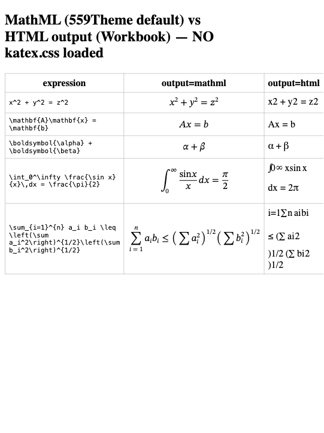
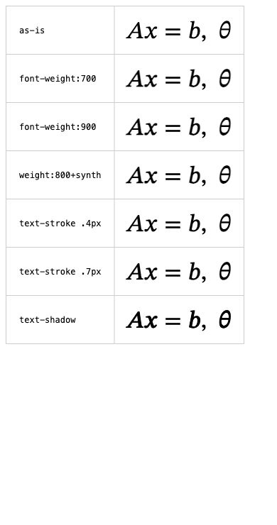
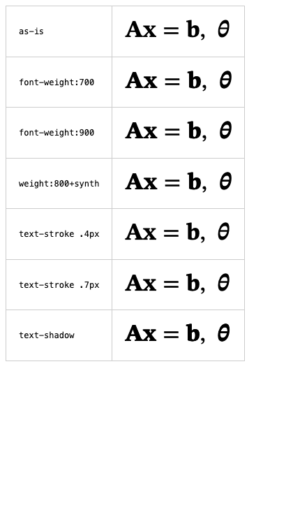
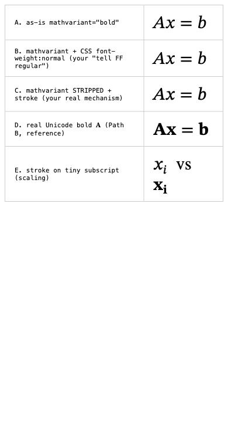
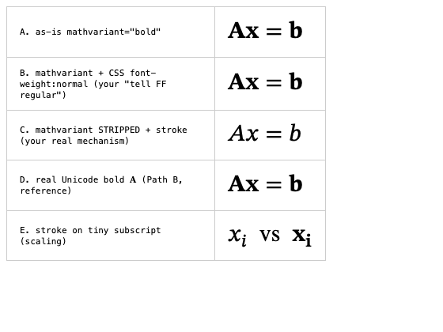

# Bold math in MathML — research & recommendation

**Status: investigated, implementation deferred.** No code has been changed for
this. The current theme still renders math via `transform.ToMath`'s default
(MathML) output, which renders correctly **except that bold does not appear
bold in Chromium** (details below). This document records what was tried, what
the evidence showed, and the recommended fix, so a future agent can implement it
without re-deriving everything.

Why deferred: (1) the in-workspace test sites have essentially no math to
validate against — the real validation set is a **held-out 5th site** with heavy
math; (2) the fix should probably be built in the **Workbook** theme first and
shared, since Workbook is the math-heavy consumer. See "Recommendation".

Related: [`../math.md`](../math.md) (how math works in the theme + the
`katex.css`/output-mode gotcha). Re-runnable test rigs: [`rigs/`](rigs/).

---

## TL;DR

- Math is rendered **at build time** by Hugo's `transform.ToMath` (KaTeX). Its
  **default output is MathML**, which the browser lays out natively — **no
  `katex.css`, no JS, no fonts, no CDN.** Structurally it renders beautifully.
- **Bold is the one failure.** `\mathbf{…}` / `\boldsymbol{…}` render at normal
  weight **in Chromium** (and Chromium-family browsers), because **Chromium's
  MathML Core ignores the `mathvariant="bold"` attribute** that KaTeX emits.
  **Firefox honors it** and renders correct bold.
- **There is no CSS-only fix.** `font-weight` (any value) does nothing —
  Chromium won't synthesize bold on the math font. `-webkit-text-stroke`
  *does* thicken glyphs, but it **double-bolds in Firefox** (which is already
  bold), so it needs fragile browser-sniffing.
- **Recommended fix (Path B): rewrite KaTeX's `mathvariant` glyphs to the actual
  Unicode Mathematical-Alphanumeric characters (𝐀, 𝐱, 𝛉…) at build time.** These
  are real bold glyphs, so they render bold in **every** browser with **zero**
  CSS/fonts/CDN and correct scaling. Add a **strip-attribute + `-webkit-text-stroke`
  pseudo-bold fallback** for any character not in the mapping, to remove the only
  risk (mapping completeness).

---

## Background: how math renders here

Two shortcodes call `transform.ToMath` (see [`../math.md`](../math.md)):

- `math.html` — inline. `displaymath.html` — numbered display equations.
- Neither passes an `output` option, so KaTeX uses its **default, MathML**.
- For `\mathbf{A}`, KaTeX emits: `<mi mathvariant="bold">A</mi>` — i.e. a plain
  ASCII "A" carrying a `mathvariant` **attribute**, *not* the bold character.

The relevant fact about that markup is how each browser treats the attribute.

---

## 1. What `katex.css` actually does (and why we don't load it)

`transform.ToMath` can emit MathML (default) or KaTeX **HTML** (`output:"html"`,
a tree of positioned ``s). We render the same equations both ways with
**no `katex.css`**:

- **`output:"mathml"` (middle): renders correctly with no CSS** — superscripts,
  the integral, the summation with limits and fractions, all laid out natively.
- **`output:"html"` (right): garbled** — superscripts not raised, integral and
  sum mangled and wrapped. The KaTeX ``s are meaningless without
  `katex.css` positioning them.

**Conclusion:** `katex.css` is mandatory **only** for `output:"html"`. That is
why the Workbook theme (which forces `output:"html"`) loads `katex.css` — and
why removing it there breaks math. The 559Theme uses MathML and correctly needs
no CSS. *Do not switch `output` to `html`/`htmlAndMathml` without bundling
self-hosted `katex.css` + KaTeX fonts.*

---

## 2. The bold problem and its root cause

Rendering one bold expression under several CSS treatments, **in Chromium**:

- **as-is, `font-weight:700`, `font-weight:900`, `font-weight:800`+forced
  `font-synthesis` — all four are pixel-identical, none bold.**
- **`-webkit-text-stroke` (.4px / .7px) and `text-shadow` — visibly bold.**

Root cause, confirmed by probing computed styles (`browser_evaluate`):

- The glyph renders with `font-family: math` (the browser's OpenType math font).
- `font-synthesis: weight` is **enabled**, yet a `font-weight:700` glyph has the
  **same advance width** as normal (measured 13.6px vs 13.6px; at 34px font,
  23.16px identical across *all* weight treatments). **Chromium does not
  synthesize faux-bold for the math font.**
- Chromium also **ignores the `mathvariant="bold"` attribute** entirely (MathML
  Core dropped it — it expects the *content* to already be bold characters).
  Measured: a plain `<mi>A</mi>` and `<mi mathvariant="bold">A</mi>` have the
  **identical** advance width (27.2px) — the attribute does nothing.

So no `font-weight` value can ever work (it is not a threshold problem — 837 or
917 would be identical). The only CSS lever that changes anything is stroking
the glyph outline.

---

## 3. The cross-browser split

The same treatments **in Firefox**:

- **as-is is already properly bold** — Firefox *honors* `mathvariant="bold"` and
  renders real bold math (it looks great; it needs no fix).
- **`-webkit-text-stroke` double-bolds** — bold glyph + stroke = too heavy,
  counters filling in.

So the browsers are split:

| Browser | `mathvariant="bold"` | Result | Needs |
|---|---|---|---|
| Chromium / Edge / Chrome | **ignored** | plain (wrong) | help (stroke or real bold char) |
| Firefox | **honored** | correct native bold | nothing — must NOT be stroked |
| Safari / WebKit | *unverified* (likely MathML-Core-like → ignored) | probably plain | probably help |

An unconditional `-webkit-text-stroke` fixes Chromium but breaks Firefox.
Scoping it to Chromium-only needs browser hacks that are dead or brittle
(`@-moz-document` no longer applies to web content; `@supports(-moz-appearance)`
is fragile). **Not acceptable for math-critical work.**

---

## 4. Approaches evaluated

| # | Approach | Works? | Cost / problem |
|---|---|---|---|
| font-weight | CSS `font-weight`/`font-synthesis` | ❌ | Chromium won't synth-bold math font; zero effect at any value |
| stroke | unconditional `-webkit-text-stroke` | ⚠️ | bold in Chromium, **double-bold in Firefox**; needs fragile sniffing |
| **B** | **Unicode substitution** (mathvariant char → 𝐀…) | ✅ | real bold **all** browsers, no CSS/fonts/CDN; needs a mapping table |
| C | `output:"html"` + self-hosted `katex.css` + fonts | ✅ | standard & robust, but ~400KB fonts + CSS; heaviest |
| strip+stroke | strip `mathvariant`, then uniform stroke | ⚠️ | consistent, but degraded pseudo-bold + throws away Firefox's good bold |

### Why Unicode substitution (B) works

`mathvariant="bold"` is *ignored*, but the actual Unicode **Mathematical Bold
Capital A** (U+1D400, "𝐀") is a real glyph in every math font. Measured widths:

| markup | advance width |
|---|---|
| `<mi>A</mi>` (plain) | 27.2px |
| `<mi mathvariant="bold">A</mi>` (KaTeX's output) | 27.2px — **ignored** |
| `<mi>𝐀</mi>` (U+1D400) | **30.0px — distinct bold glyph** ✅ |

Rewriting `<mi mathvariant="bold">A</mi>` → `<mi>𝐀</mi>` gives true bold in
Chromium **and** Firefox **and** (by construction) Safari, with no CSS and no
per-browser logic, and it scales with math size natively.

### Critique of "strip + uniform stroke"

The idea: normalize every browser to "plain," then thicken uniformly (no
sniffing). Tested directly:

Findings:

- **Row B: `font-weight:normal` does NOT neutralize Firefox** — it stays bold.
  Firefox's `mathvariant` bold is *glyph substitution*, immune to `font-weight`.
  So "tell Firefox to use regular weight" via CSS is impossible.
- **Row C: stripping the `mathvariant` attribute *does* neutralize Firefox** — it
  then renders plain, matching Chromium; a uniform stroke applies to both. So the
  idea works **only** with a **build-time transform** (strip attribute → class),
  not pure CSS. That is the same transform infrastructure Path B needs.
- **Quality: pseudo-bold is inferior** (compare row C stroke to row D real
  Unicode bold, in both browsers). It also **doesn't scale** — row E: a fixed-px
  stroke on a tiny subscript is proportionally too heavy, while the Unicode
  subscript stays crisp. And it **discards Firefox's free, high-quality native
  bold**.

Verdict: it solves *consistency* but by leveling everything down to a mediocre
pseudo-bold — and it still needs a transform. Since Path B needs the same
transform pass and its only extra cost is the (generatable) mapping table, **B
dominates** — except as a *fallback* for characters the mapping misses.

---

## Recommendation

**Implement Path B (Unicode substitution) with a strip+stroke fallback**:

1. A build-time transform over the `transform.ToMath` MathML output that, for
   each `<mi|mn|mo mathvariant="V">c</mi>`, replaces `c` with the corresponding
   Unicode Mathematical-Alphanumeric codepoint for variant `V` and drops the
   attribute. Cover the variants KaTeX emits: bold, italic, bold-italic,
   script/calligraphic, fraktur, double-struck, sans-serif (+bold/italic),
   monospace.
2. **Generate the mapping** with Python `unicodedata` (look up names like
   "MATHEMATICAL BOLD CAPITAL A"), *don't* hand-type it — this also handles the
   ~30 exception codepoints the block leaves out (ℎ, ℬ, ℯ, ℯ, ℊ, …, and the
   dotless/Planck cases). Emit as a theme data file.
3. **Fallback:** for any `(variant, char)` not in the mapping, instead of
   emitting a wrong/missing glyph, strip the attribute → add a class and apply a
   small `-webkit-text-stroke` pseudo-bold (size-aware if feasible). This removes
   the only real risk of Path B (mapping gaps) at the cost of occasional
   lower-quality bold on exotic glyphs.

**Where to build it:** likely in **Workbook first** (the math-heavy theme,
currently on the `output:"html"`+CDN-`katex.css` approach), then share the
transform with 559Theme so the whole site family renders math identically and
dependency-free. This would also let Workbook **drop its jsDelivr `katex.css`
CDN dependency** (an external dependency of the same class we removed from
559Theme when we deleted the MathJax partial).

**Validate** against real notation — the held-out 5th math-heavy site is the
acceptance set. Check in **Chromium and Firefox** (both drivable locally; see
`rigs/README.md`), and ideally Safari.

### Do NOT

- Do **not** rely on `font-weight` / `font-synthesis` (no effect in Chromium).
- Do **not** apply an unconditional `-webkit-text-stroke` (double-bolds Firefox).
- Do **not** switch to `output:"html"` without **self-hosted** `katex.css`+fonts
  (never a CDN).

---

## Files

- `img/` — the evidence screenshots referenced above (Chromium via Playwright;
  Firefox via headless `--screenshot`).
- `rigs/` — the re-runnable test harnesses + how to run them and re-capture.
